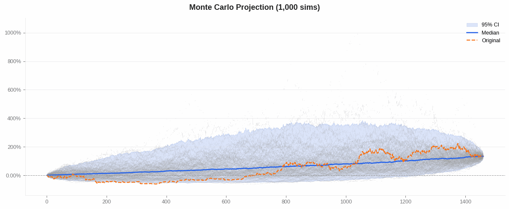
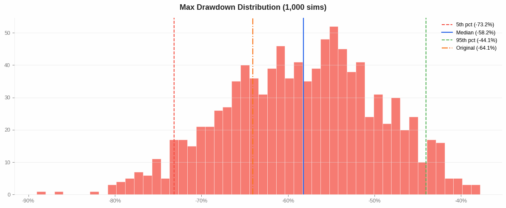

# Monte Carlo simulation

Pass `monte_carlo=True` to `reports.html()` or `reports.full()` to resample
your historical returns thousands of times and see the range of outcomes luck
alone could have produced:

```python
katsustats.reports.html(
    returns,
    output="report.html",
    monte_carlo=True,
    mc_sims=1000,       # number of simulated paths (default 1000)
    mc_bust=-0.20,      # optional: probability of hitting this drawdown
    mc_goal=0.50,       # optional: probability of reaching this return
    mc_seed=42,         # optional: reproducibility seed
    mc_method="bootstrap",  # "bootstrap" (default) or "shuffle"
)
```

`bootstrap` samples returns **with replacement**, so terminal return, Sharpe,
and CAGR vary across paths. `shuffle` permutes without replacement, so
terminal return is identical across paths, but max drawdown still varies —
drawdown is path-dependent: a run of losses early hurts far more than the
same losses late.

The HTML report adds simulated-paths and max-drawdown-distribution panels
(see below). Underlying stats are callable directly:

```python
# Raw simulation paths as a wide Polars DataFrame
paths = katsustats.stats.monte_carlo_paths(returns, sims=1000, seed=42, method="bootstrap")

# Probabilistic summary: terminal return, max drawdown, Sharpe, CAGR distributions
summary = katsustats.stats.monte_carlo_summary(
    returns,
    sims=1000,
    bust=-0.20,   # drawdown threshold for bust probability
    goal=0.50,    # return threshold for goal probability
    seed=42,
    method="bootstrap",
)
```

| Simulated paths | Max drawdown distribution |
|-----------------|--------------------------|
|  |  |
