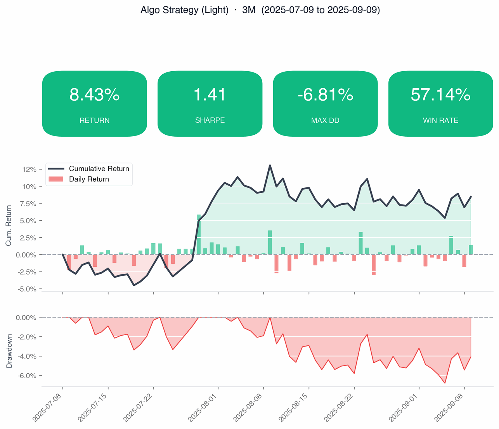
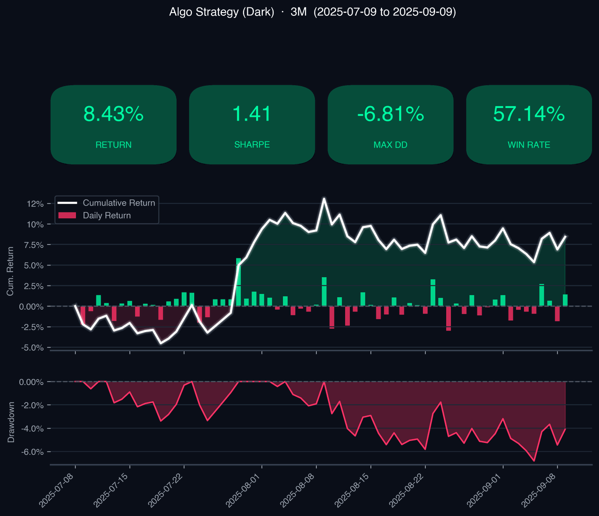

# Snapshot report

A compact, single-image performance card showing key metrics, an equity
curve, and underwater drawdowns — for quick sharing on social media or chat.

| Light Theme | Dark Theme |
|-------------|------------|
|  |  |

**Via CLI:**

```bash
katsustats snapshot trades.csv --window 1M -o snapshot.png
katsustats snapshot trades.csv --title "My Strategy" --window 3M -o snapshot.png
katsustats snapshot trades.csv --theme dark -o snapshot.png
```

**Via Python:**

```python
fig = katsustats.plots.plot_snapshot(returns, window="3M", title="My Strategy")
fig.savefig("snapshot.png")

fig = katsustats.plots.plot_snapshot(returns, window="3M", title="My Strategy", theme="dark")
fig.savefig("snapshot_dark.png", facecolor=fig.get_facecolor())
```
